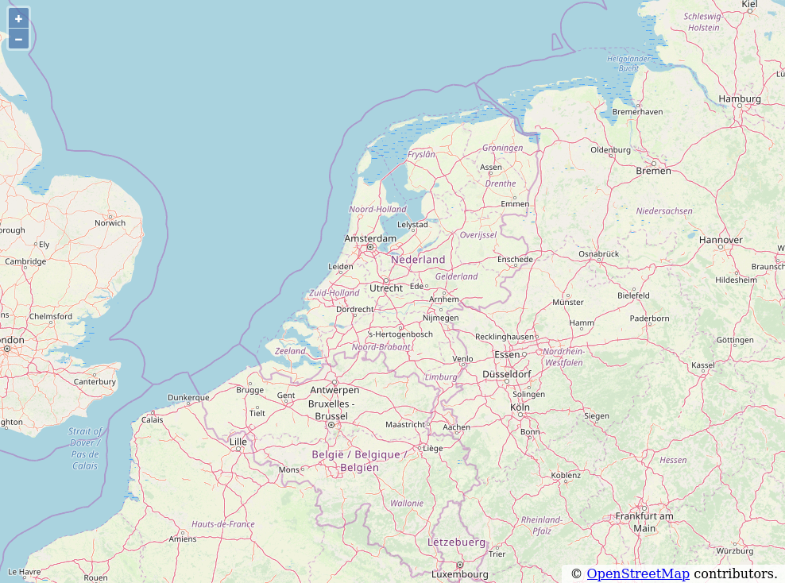
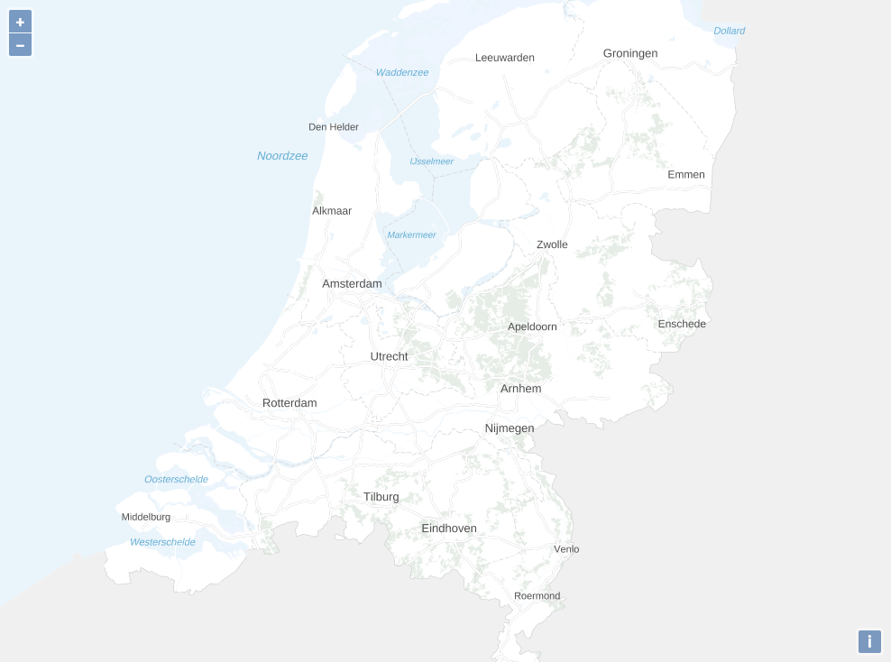
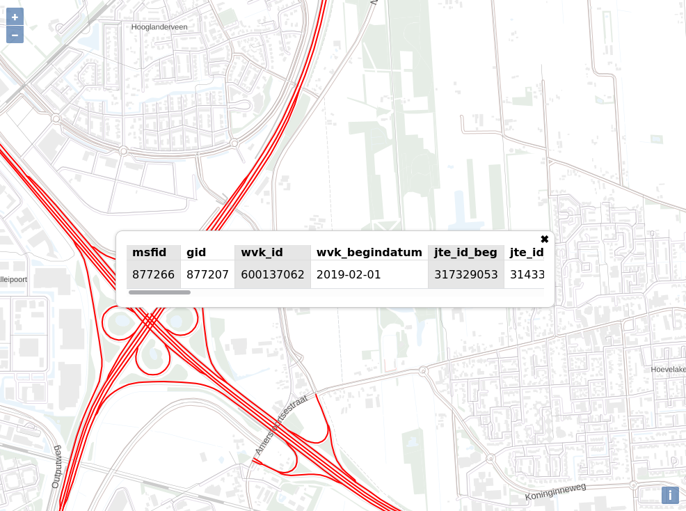
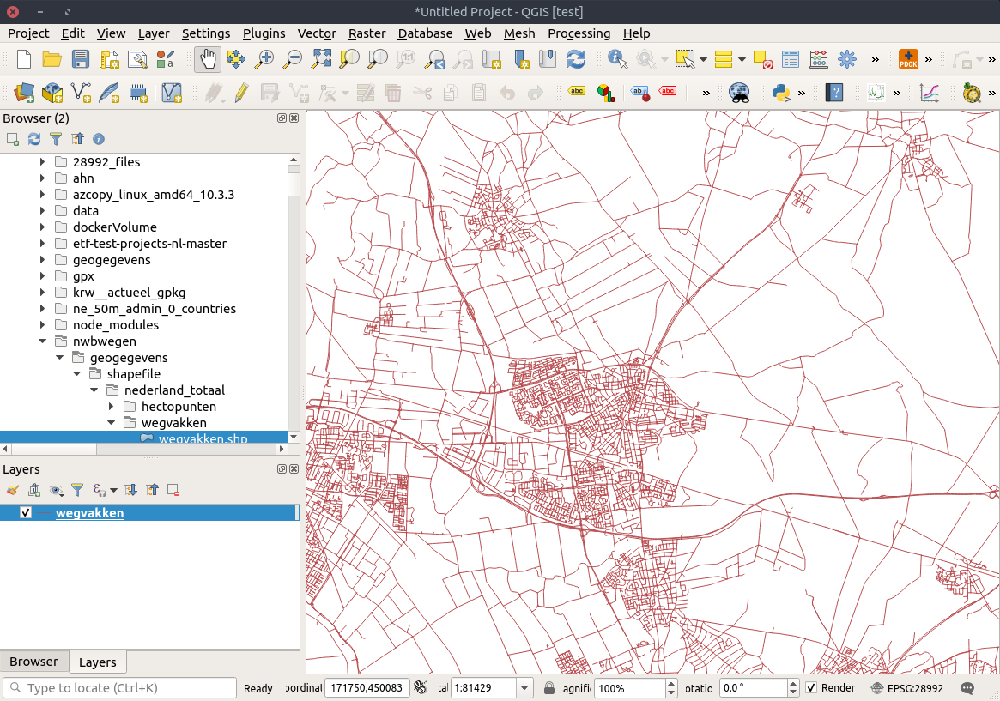
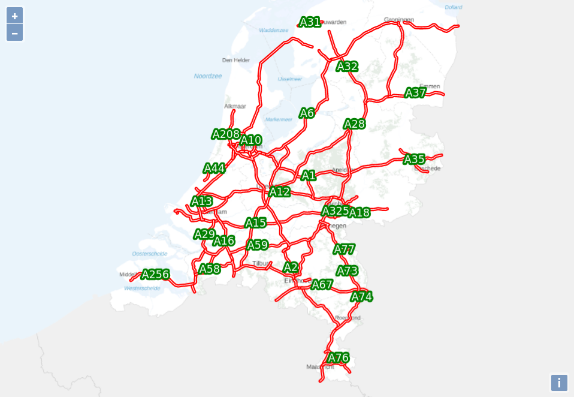
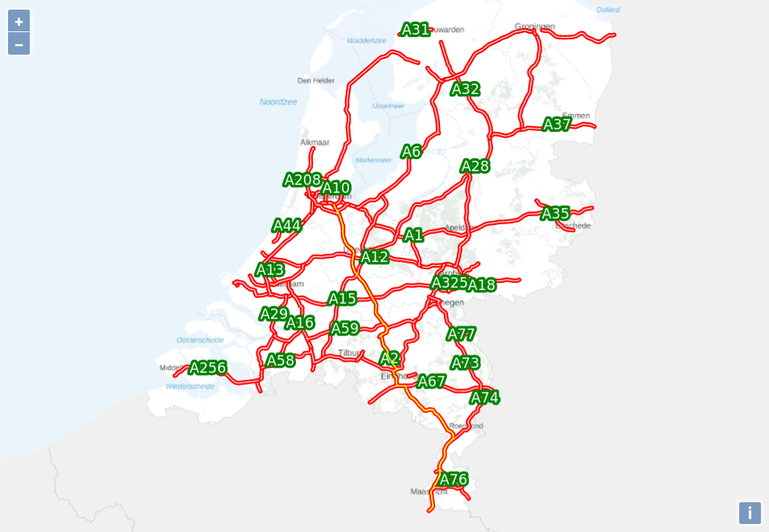

<!-- TITLE: PDOK Webservices Workshop -->

<div style="background-color:#1A1E4F;padding:1em; border-radius: 3px;">
[](https://pdok.nl)
</div>

<!-- TOC -->

- [1. Introduction](#1-introduction)
- [2. About PDOK](#2-about-pdok)
    - [2.1. OGC Web Services (OWS)](#21-ogc-web-services-ows)
    - [2.2. Web Map Service (WMS)](#22-web-map-service-wms)
    - [2.3. Web Map Tile Service (WMTS)](#23-web-map-tile-service-wmts)
    - [2.4. Web Feature Service (WFS)](#24-web-feature-service-wfs)
    - [2.5. Nationaalgeoregister and Catalogue Service for the Web (CSW)](#25-nationaalgeoregister-and-catalogue-service-for-the-web-csw)
- [3. Workshop](#3-workshop)
    - [3.1. Setting up NPM Project with OpenLayers](#31-setting-up-npm-project-with-openlayers)
    - [3.2. Adding Base Map](#32-adding-base-map)
    - [3.3. Adding WMS to Viewer](#33-adding-wms-to-viewer)
        - [3.3.1. Adding WMS Layer to Viewer](#331-adding-wms-layer-to-viewer)
        - [3.3.2. Adding Featureinfo on Click to Viewer](#332-adding-featureinfo-on-click-to-viewer)
    - [3.4. Adding a GeoJSON Layer](#34-adding-a-geojson-layer)
        - [3.4.1. Data Preprocessing](#341-data-preprocessing)
        - [3.4.2. Adding GeoJSON as a Layer](#342-adding-geojson-as-a-layer)
    - [3.5. Using the PDOK Location Server](#35-using-the-pdok-location-server)
        - [3.5.1. Adding Custom Control](#351-adding-custom-control)
        - [3.5.2. Get Suggestions from Locatie Server](#352-get-suggestions-from-locatie-server)
        - [3.5.3. Get Result from Locatie Server](#353-get-result-from-locatie-server)
- [4. Referenties](#4-referenties)

<!-- /TOC -->

<a id="markdown-1-introduction" name="1-introduction"></a>

## 1. Introduction

In this workshop you will build a web application with an interactive map using the PDOK (map) services. The web application is build with OpenLayers version 6.2.1, an Open Source Javascript library. 

While building the webapplication you will learn the difference between the different (geo) service types PDOK is providing, such as WMS, WMTS, WFS and WCS. 

https://www.dropbox.com/sh/6j3e40thy9pspoi/AACS2NCHaT0h8JbKLTDSpZx9a?dl=0


> NOTE: All created applications in this workshop will use the cartographic projection [*Web Mercator*](https://en.wikipedia.org/wiki/Web_Mercator_projection) `EPSG:3857`. This is the de facto standard in map projections for web mapping applications. Governmental organisations in the Netherlands often require the use of the [*Amersfoort/RD New*](https://nl.wikipedia.org/wiki/Rijksdriehoeksco%C3%B6rdinaten) `EPSG:28992` projection, some the map services of PDOK are only available in the *Amersfoort/RD New* projection. More information about map projections can be found on [Wikipedia](https://en.wikipedia.org/wiki/Map_projection).


<a id="markdown-2-about-pdok" name="2-about-pdok"></a>

## 2. About PDOK

> TODO:
> - Explain what PDOK is
> - Explain what services we provide

PDOK is the geographical open data platform of the Dutch government. Publieke Dienstverlening op de Kaart (PDOK) provides geo web services for many Dutch governmental organisations, for instance Kadaster, CBS, RIVM, Rijkswaterstaat and many more.  

Due to the [open standards policy](https://www.digitaleoverheid.nl/overzicht-van-alle-onderwerpen/standaardisatie/open-standaarden/) of the Dutch government, PDOK is using a lot of open standard where appropriate. Open standard contribute to interoperability and prevent vendor lock-in, this is important since many of the users of the PDOK services are govermental organisations themselves.

Many of the standards used by PDOK concern the web service interfaces, but PDOK also uses a range of different file format standards. Many of these standards are specific for the geographical domain and originate from the Open GeoSpatial Consortium (OGC). The OGC is non-governmental, industry members organization. Members include big corporations such as Google and ESRI, but also governmental agencies are members. Members of the OGC corporate on the development of geospatial open standards. The OGC is very much like the World Wide Web Consortium (W3C), but instead of standards for the web, it makes standards for geospatial. 

The most import standards for geospatial web services are:

- Web Map Service (WMS) - serves out maps
- Web Map Tile Service (WMTS) - serves out map-tiles
- Web Feature Service (WFS) - serves out vector data (also know as features)
- Web Coverage Service (WCS) - serves out raster data (also known as coverages)
- Catalogue Service for the Web (CSW) - serves out metadata from the catalogue (metadata describes datasets and/or services)

<a id="markdown-21-ogc-web-services-ows" name="21-ogc-web-services-ows"></a>

### 2.1. OGC Web Services (OWS)

The above group of service protocols is also known as the OGC Web Services (OWS). In API design these service types are very similar. For instance all service types use XML to exchange message between client and server. Also you can request for each service type a Capabilities document, which describes what that particular service instance is capable of. You can request a Capabilities document by sending a HTTP GET request with the following query parameters:

```
service={SERVICE_TYPE}&request=GetCapabilities
```

For instance for a WMS service the request looks like this:

```
http://geodata.nationaalgeoregister.nl/cbspostcode4/wms?request=GetCapabilities&service=WMS
```

<a id="markdown-22-web-map-service-wms" name="22-web-map-service-wms"></a>

### 2.2. Web Map Service (WMS)

WMS is a service protocol for maps; a WMS serves map images rendered from geographical data and styling rules. A WMS does not serve the underlying data. WMS supports the following three requests:

- GetCapabilities: capabilities document describes layer/styles/formats/request
- GetFeatureInfo: request feature info for location
- GetMap: request map image
  - request=GetMap
  - service=WMS
  - version=1.3.0
  - layers={kommalijst 1 of meer lagen}
  - styles={kommalijst overeenkomstige laagstijlen}
  - crs={coordinatensysteem}
  - bbox={minx,miny,maxx,maxy}
  - width={breedte afbeelding}
  - height={hoogte afbeelding}
  - format={afbeeldingsformaat}


Example WMS GetMap HTTP GET request:

```
https://geodata.nationaalgeoregister.nl/cbspostcode4/wms?SERVICE=WMS&VERSION=1.3.0&REQUEST=GetMap&FORMAT=image%2Fpng&TRANSPARENT=true&layers=postcode42017&CRS=EPSG%3A28992&STYLES=&WIDTH=2780&HEIGHT=929&BBOX=-937574%2C70963%2C1453670%2C870051
```

Nadeel van het WMS protocol is dat elk request van de client uniek is, door de combinatie van de bounding box (bbox) en de afmetingen van de afbeelding. Dit zorgt ervoor dat het in de praktijk onmogelijk is om een WMS service te cachen. Over het algemeen vergen WMS requests intensief CPU gebruik, het is niet ongewoon dat een WMS er een seconde over doet om een response te genereren.

<a id="markdown-23-web-map-tile-service-wmts" name="23-web-map-tile-service-wmts"></a>

### 2.3. Web Map Tile Service (WMTS)

To overcome the CPU intensive on-the-fly rendering problem, application developers started using pre-rendered map tiles. Several open and proprietary schemes were invented to organize and address these map tiles. An earlier specification for this is the Tile Map Service (TMS).

The idea behind WMTS is that de zoomlevels fixed zijn, en dat voor elk zoomlevel opgedeelt in een eindig aantal tiles. Dit resulteert in het algemeen in een tilematrix piramide, met op het laagste zoomniveau (0) 1 (2^0) tegels en op het hoogste zoomniveau (22) 4194304 (2^22) tegels. De simpelste tilematrix halveert elke tegel, per zoomniveau dieper, alhoewel de WMTS specificatie ook complexere tilematrixsets ondersteund.

WMTS specificeert meerdere request encodings, maar om het simpel te houden behandelen we hier alleen de key-value-pairs encoding (KVP).

Get requests:
- GetCapabilities:
- GetMap:
- request=GetTile
- service=WMTS
- version=1.0.0
- layer={laag}
- style={laagstijl}
- tilematrixset={tilematrixset}
- TileMatrix={zoom niveau}
- TileCol={y coordinate in tegelnr}
- TileRow={x coordinate in tegelnr}
- format={afbeeldingsformaat}

Een voorbeeld van een KVP WMTS GetTile HTTP GET request:

https://geodata.nationaalgeoregister.nl/tiles/service/wmts?layer=brtachtergrondkaart&style=default&tilematrixset=EPSG%3A28992&Service=WMTS&Request=GetTile&Version=1.0.0&Format=image%2Fpng&TileMatrix=02&TileCol=2&TileRow=1


<a id="markdown-24-web-feature-service-wfs" name="24-web-feature-service-wfs"></a>

### 2.4. Web Feature Service (WFS)

<a id="markdown-25-nationaalgeoregister-and-catalogue-service-for-the-web-csw" name="25-nationaalgeoregister-and-catalogue-service-for-the-web-csw"></a>

### 2.5. Nationaalgeoregister and Catalogue Service for the Web (CSW)

CSW is een protocol om metadata records te doorzoeken die op de server staan. De catalogue in CSW is een catalogus van metadata records, deze metadata records beschrijven of datasets of services. Een centrale voorziening in de Nederlandse geodata infrastructuur is het nationaalgeoregister.nl. Dit is een geoportal waar alle gepubliceerde (geo) datasets en services van Nederlandse overheidsorganistaies in zitten, dit geoportaal implementeerd ook een CSW endpoint.

Een voorbeeld van een CSW GetRecords HTTP GET request:
```
https://www.nationaalgeoregister.nl/geonetwork/srv/dut/csw?request=GetRecords&Service=CSW&Version=2.0.2&typeNames=gmd:MD_Metadata&constraint=keyword=%27defensie%27&constraintLanguage=CQL_TEXT&constraint_language_version=1.1.0&resultType=results
```

<a id="markdown-3-workshop" name="3-workshop"></a>

## 3. Workshop

<a id="markdown-31-setting-up-npm-project-with-openlayers" name="31-setting-up-npm-project-with-openlayers"></a>

### 3.1. Setting up NPM Project with OpenLayers

#### 3.1.1 Install dependencies and setup ESLint

First start by modifying your profiles path in the Bash shell, edit the file `~/.profile` and add the following line:

```bash
export PATH=./node_modules/.bin:$PATH
```

Next make sure you load the changes in your profile by sourcing the profile file:

```bash
source ~/.profile
```

Then run the following commands from the root of this repository:

```bash
mkdir webapp && cd webapp
npm init -y 
npm install ol
npm install --save-dev parcel-bundler eslint
```

Setting up a linter helps with detecting syntax errors and conforming to a particular style guide. This workshop uses ESLint a JavaScript linter, setup ESLint by running `eslinit --init` and answer questions with:

- How would you like to use ESLint?
    - To check syntax, find problems, and enforce code style
- What type of modules does your project use? (Use arrow keys)
    - JavaScript modules (import/export)
- Which framework does your project use? 
    - None of these 
- Does your project use TypeScript? 
    - n
- Where does your code run?
    - Browser
- Which style guide do you want to follow? 
    - Use a popular style guide
- Which style guide do you want to follow? 
    - Standard: https://github.com/standard/standard
- What format do you want your config file to be in? (Use arrow keys)
    - JavaScript 
- Would you like to install them now with npm?
    - y


To setup ESLint in VS Code, install the [ESLint extension](https://marketplace.visualstudio.com/items?itemName=dbaeumer.vscode-eslint) for VS Code. Then add the following to your VS Code preferences in `settings.json` (through `File>Preferences` then click icon in upper right corner to show the actual JSON): 

```js
"editor.codeActionsOnSave": {
  "source.fixAll": true
},
"eslint.workingDirectories": [ "./webapp" ]
```

This will make sure ESLint will run on save and detect the `webapp` directory as a working directory.

#### 3.1.2 Build first webmap with OpenLayers 

Now let's start coding, create the file `index.js` in the folder `webapp` with the following content:

```js
import 'ol/ol.css'
import { Map, View } from 'ol'
import OSM from 'ol/source/OSM'
import TileLayer from 'ol/layer/Tile.js'
import {fromLonLat} from 'ol/proj'

var map = new Map({ // eslint-disable-line no-unused-vars
  target: 'map',
  layers: [
    new TileLayer({
      source: new OSM()
    })
  ],
  view: new View({
    center: fromLonLat([5.43, 52.18]),
    zoom: 8
  })
})
```

The above JavaScript file uses the [`OSM`](https://openlayers.org/en/v6.2.1/apidoc/module-ol_source_OSM-OSM.html) class to add the [standard OpenStreetMap (OSM) tile layer](https://wiki.openstreetmap.org/wiki/Standard_tile_layer).

Create the file `index.html` in the folder `webapp` with the following content:

```html
<!DOCTYPE html>
<html>

<head>
    <meta charset="utf-8">
    <title>PDOK Webservices</title>
    <style>
        html,
        body {
            height: 100%;
            margin: 0px;
        }

        #map {
            height: 100%;
        }
    </style>
</head>

<body>
    <div id="map"></div>
    <script src="./index.js"></script>
</body>

</html>
```

Replace the `scripts` element in the `webapp/package.json` file with the following:

```json
"scripts": {
    "test": "echo \"Error: no test specified\" && exit 1",
    "start": "parcel index.html",
    "build": "parcel build --public-url . index.html"
}
```

No run the following command from the `webapp/` directory:

```
npm start
```

Visit [`http://localhost:1234/`](http://localhost:1234/) to view the glorious result. If correct you should see a interactive map in your browser with the default OpenLayers basemap.



<a id="markdown-32-adding-base-map" name="32-adding-base-map"></a>

### 3.2. Adding Base Map

> TODO: Summary of section. 

Replace the code in `viewer/index.js` with the following:

```js
import 'ol/ol.css'
import { Map, View } from 'ol'
import WMTSSource from 'ol/source/WMTS'
import TileLayer from 'ol/layer/Tile.js'
import WMTSTileGrid from 'ol/tilegrid/WMTS.js'
import { get as getProjection, fromLonLat } from 'ol/proj'
import { getTopLeft, getWidth } from 'ol/extent.js'

const projection = getProjection('EPSG:3857')
const projectionExtent = projection.getExtent()
const size = getWidth(projectionExtent) / 256
const resolutions = new Array(20)
const matrixIds = new Array(20)

for (let z = 0; z < 20; ++z) {
  // generate resolutions and matrixIds arrays for this WMTS
  // see https://openlayers.org/en/latest/examples/wmts.html
  resolutions[z] = size / Math.pow(2, z)
  matrixIds[z] = z
}

const baseMapLayer = new TileLayer({
  extent: projectionExtent,
  source: new WMTSSource({
    url: 'https://geodata.nationaalgeoregister.nl/tiles/service/wmts',
    layer: 'brtachtergrondkaartgrijs',
    matrixSet: 'EPSG:3857',
    format: 'image/png',
    attributions: 'Map data: <a href="http://www.kadaster.nl">Kadaster</a>
',
    tileGrid: new WMTSTileGrid({
      origin: getTopLeft(projectionExtent),
      resolutions: resolutions,
      matrixIds: matrixIds
    }),
    style: 'default'
  })
})

const map = new Map({ // eslint-disable-line no-unused-vars
  layers: [
    baseMapLayer
  ],
  target: 'map',
  view: new View({
    center: fromLonLat([5.43, 52.18]),
    zoom: 8
  })
})
```



<a id="markdown-33-adding-wms-to-viewer" name="33-adding-wms-to-viewer"></a>

### 3.3. Adding WMS to Viewer

> TODO: Summary of section. 

<a id="markdown-331-adding-wms-layer-to-viewer" name="331-adding-wms-layer-to-viewer"></a>

#### 3.3.1. Adding WMS Layer to Viewer

Now we have good looking basemap it is time to display something on top of it. 

[*NWB Wegen*](https://www.pdok.nl/introductie/-/article/nationaal-wegen-bestand-nwb-) dataset which is also published as a WMS service. The *Geo Services* tab provides a [WMS service url](https://geodata.nationaalgeoregister.nl/nwbwegen/wms?request=GetCapabilities&service=wms). The URL provided links to the `capabilities` document, which describes what the service is capable of. The capabilities document lists which layers, styles, image formats and projections are available and more.

To add the `wegvakken` layer from the WMS service to the map add the following to the `view/index.js` document before the declaration of the `map` object and do not forget to add `wsmLayer` to the map object. We also need to set the zoomlevel of the initial view to `14` in order to see the WMS layer. This is due to the way this WMS service is configured, in the capabilities document the `wegvakken` layer has a `MaxScaleDenominator` property set to `50000`. This means that the layer is visible from scale `1:1` until `1:50000`. In terms of WMTS zoomlevels this means that layer is visible from zoomlevel `14` and up.

```js
import ImageLayer from 'ol/layer/Image'
import ImageWMS from 'ol/source/ImageWMS'

const wmsSource = new ImageWMS({
  url: 'https://geodata.nationaalgeoregister.nl/nwbwegen/wms?',
  crossOrigin: 'anonymous',
  params: { LAYERS: 'wegvakken' }
})

const wsmLayer = new ImageLayer({
  extent: projectionExtent,
  source: wmsSource
})

const map = new Map({ // eslint-disable-line no-unused-vars
  layers: [
    baseMapLayer,
    wsmLayer
  ],
  target: 'map',
  view: new View({
    center: fromLonLat([5.43, 52.18]),
    zoom: 14
  })
})

```
Your map application should now display the `wegvakken` layer:


> TODO: explain about scale dependent layer in the WMS, and other disadvantages of the WMS. 

<a id="markdown-332-adding-featureinfo-on-click-to-viewer" name="332-adding-featureinfo-on-click-to-viewer"></a>

#### 3.3.2. Adding Featureinfo on Click to Viewer

The WMS standard provides a mechanism to retrieve information of features, the underlying vector data of the map. The request do retrieve feature information is called `GetFeatureInfo`. The WMS specification does not require the implementation of the `GetFeatureInfo` request, therefore a client should always check in the [capabilities document](https://geodata.nationaalgeoregister.nl/nwbwegen/wms?request=GetCapabilities&service=wms) if the service support the `GetFeatureInfo` request. The NWB wegen WMS supports the `GetFeatureInfo` request, it is listed in the `Capability/Request` element in the XML. 

In this section we are going to add functionality so show a popup with feature information when a users clicks on the map. To do this add the following to the `body` element of `index.html`, before the `script.js` inclusion:

```html
<div id="popup" class="ol-popup">
    <a href="#" id="popup-closer" class="ol-popup-closer"></a>

    <div id="popup-content"></div>
</div>
```

Add the following code to `index.js` before the `map` constant declaration:

```js
import Overlay from 'ol/Overlay'

// Elements that make up the popup.
var container = document.getElementById('popup')
var content = document.getElementById('popup-content')
var closer = document.getElementById('popup-closer')

// Create an overlay to anchor the popup to the map.
var overlay = new Overlay({
  element: container,
  autoPan: true,
  autoPanAnimation: {
    duration: 250
  }
})

// Add a click handler to hide the popup.
closer.onclick = function () {
  overlay.setPosition(undefined)
  closer.blur()
  return false
}
```

Add the `overlay` const to the `map` object:

```js
const map = new Map({
  layers: [
    baseMapLayer,
    wsmLayer
  ],
  target: 'map',
  overlays: [overlay],
  view: new View({
    center: fromLonLat([5.43, 52.18]),
    zoom: 14
  })
})
```

Add the `singleclick` eventhandler on the map object below the `map` declaration in `index.js`:

```js
map.on('singleclick', function(evt) {
  // clean content of popup on every new singeclick event
  if (content.childNodes.length > 0) content.childNodes[0].remove()
  var viewResolution = /** @type {number} */ (map.getView().getResolution());
  var url = wmsSource.getFeatureInfoUrl(
    evt.coordinate, viewResolution, 'EPSG:3857',
    {'INFO_FORMAT': 'application/json'});
  if (url) {
    fetch(url)
      .then(function (response) { return response.json() })
      .then(function (data) {
        // set overlay position to undefined to hide popup
        if (data.features.length == 0){
          overlay.setPosition(undefined)
          return
        }
        let ft = data.features[0]
        let table = document.createElement("table")
        var header = table.createTHead()
        var row = header.insertRow()
        let i=0
        Object.keys(ft.properties).forEach(function(item){
          let cell = row.insertCell(i)
          cell.innerHTML = item
          i++
        })
        let body = table.createTBody()
        row = body.insertRow()
        i=0
        Object.keys(ft.properties).forEach(function(item){
          let cell = row.insertCell(i)
          cell.innerHTML = ft.properties[item]
          i++
        })
        content.appendChild(table)
        overlay.setPosition(evt.coordinate)
      })
  }
})
```

And add the following CSS to a new `index.css` file in the root of the `webapp` folder:

```css
html, body {
    height: 100%;
    margin: 0px;
}

#map {
    height: 100%;
}

.ol-popup {
    position: absolute;
    background-color: white;
    box-shadow: 0 1px 4px rgba(0, 0, 0, 0.2);
    padding: 15px;
    border-radius: 10px;
    border: 1px solid #cccccc;
    bottom: 12px;
    left: -50px;
    min-width: 40vw;
    max-width: 60vw;
    padding-top: 20px;
}

.ol-popup:after, .ol-popup:before {
    top: 100%;
    border: solid transparent;
    content: " ";
    height: 0;
    width: 0;
    position: absolute;
    pointer-events: none;
}

.ol-popup:after {
    border-top-color: white;
    border-width: 10px;
    left: 48px;
    margin-left: -10px;
}

.ol-popup:before {
    border-top-color: #cccccc;
    border-width: 11px;
    left: 48px;
    margin-left: -11px;
}

.ol-popup-closer {
    text-decoration: none;
    position: absolute;
    top: 2px;
    right: 8px;
}

.ol-popup-closer:visited {
    text-decoration: inherit;
    color: inherit;
    cursor: auto;
}

.ol-popup-closer:after {
    content: "✖";
}

#popup-content {
    overflow-x: scroll;
}

table {
    border: none;
    border-collapse: collapse;
    font-family: sans-serif;
}

table td {
    border-left: 1px solid #ddd;
    border-right: 1px solid #ddd;
    padding-left: 0.5em;
    padding-right: 0.5em;
}

thead>tr>td {
    border-bottom: 1px solid #ddd;
    font-weight: 600;
}

table td:first-child {
    border-left: none;
}

table td:last-child {
    border-right: none;
}

tbody td:nth-of-type(odd), thead td:nth-of-type(odd) {
    background: #E6E6E6;
}
```

Remove the `style` element from the `index.html` file and replace with:

```html
<link rel="stylesheet" type="text/css" href="index.css">
```


Reload the webapp in the browser,now the map should display a popover when a feature is clicked on the map.



What happens in the background is that OpenLayers registers on which pixel coordinate a user clicks. This is information is combined with the query parameters of the previous WMS `GetMap` request, to create a `GetFeatureInfo` request. In the below example `GetFeatureInfo` request the user clicked on pixel coordinate `50,50` of an image with `WIDTH` and `HEIGHT` of `101,101`, [this](https://geodata.nationaalgeoregister.nl/nwbwegen/wms?SERVICE=WMS&VERSION=1.3.0&REQUEST=GetMap&FORMAT=image%2Fpng&TRANSPARENT=true&LAYERS=wegvakken&CRS=EPSG%3A3857&STYLES=&WIDTH=101&HEIGHT=101&BBOX=603781.6790671768%2C6831433.221161786%2C604746.696549277%2C6832398.238643886) is the corresponding `GetMap` request.

```
https://geodata.nationaalgeoregister.nl/nwbwegen/wms?SERVICE=WMS&
VERSION=1.3.0&
REQUEST=GetFeatureInfo&
FORMAT=image%2Fpng&
TRANSPARENT=true&
QUERY_LAYERS=wegvakken&
LAYERS=wegvakken&
INFO_FORMAT=application%2Fjson&
I=50&
J=50&
CRS=EPSG%3A3857&
STYLES=&
WIDTH=101&
HEIGHT=101&
BBOX=603781.6790671768%2C6831433.221161786%2C604746.696549277%2C6832398.238643886
```

<a id="markdown-34-adding-a-geojson-layer" name="34-adding-a-geojson-layer"></a>

### 3.4. Adding a GeoJSON Layer

>  TODO: The advantage of using WMS/WMTS services is that you do not have take rendering performance into consideration, that is the job the server. 

A different approach to displaying geographical data is, instead of using WMS and WMTS services, downloading the vector data in the client and displaying the vector data directly. In this scenario there is no need for a server and gives you complete freedom of styling of the data. One major drawback of this approach is performance, processing power on the client is limited; there is a upper limit on the number of features you can load in your map (at once).

When rendering geographical data directly on the client rendering performance is a concern. You can optimize for this by preprocessing your data to either:

1. Reduce the size of the dataset by removing features
2. Reduce the size of the dataset by simplifcation of the geometries (aggregation, generalization)

> TODO: include, yes, no? Another technique to improve performance is to load features from the data incrementally into map application, instead all of once. This can be done with the client side vector tile library [geojson-vt](https://github.com/mapbox/geojson-vt) JavaScript library. 

In this workshop we only do preprocessing of the data to reduce the size of the dataset. This is done by selecting only the motorways (A wegen) and joining the seperate segments into one geometry grouped by the roadletter and roadnumber combination (for instance group by A1, A2, A348 etcetera). We will use the `ogr2ogr` commandline utility for data processing.

<a id="markdown-341-data-preprocessing" name="341-data-preprocessing"></a>

#### 3.4.1. Data Preprocessing

In this chapter we are going to create a map of the Dutch motor ways, directly rendered in the browser from a GeoJSON file. We will use the [NWB Wegen dataset](https://www.pdok.nl/introductie/-/article/nationaal-wegen-bestand-nwb-), PDOK provides WMS en WFS services and also a direct download service. In this case we will use the PDOK download service, since we want to obtain the full dataset.

> NOTE: If you are using the VirtualBox image that comes with the workshop you do not need to download the file, it is already downloaded in `~/pdok-webservices-workshop/data`. 

First ensure your current working directory is `~/pdok-webservices-workshop`:

```
cd ~/pdok-webservices-workshop
```

```bash
curl "http://geodata.nationaalgeoregister.nl/nwbwegen/extract/nwbwegen.zip" -o data/nwbwegen.zip
```

```
unzip data/nwbwegen.zip -d data/
```

Open the Shapefile in QGIS to inspect data from the NWB wegen dataset, Shapefile is located in: `data/geogegevens/shapefile/nederland_totaal/wegvakken/wegvakken.shp`



You will notice that QGIS has a hard time rendering all the features at once when viewing the full extent of the Netherlands. This is a sure sign your browser will have a hard time rendering all this data. To make life easy for the browser we will extract only the motorways froms this dataset. 

Another concern is that the roads in the `wegvakken` layer from NWB-wegen are divided in many seperate segments. This is not ideal for styling and labelling the in the webapplication. Therefore we need to merge the geometries, and we can immediately group them by route-letter and route-number (A2, A10, A348, etcetera). 

First step is to convert the shapefile to GPKG and select only the `A` routes ([GeoPackage](https://en.wikipedia.org/wiki/GeoPackage) is the superior geospatial file format, although Shapefile is [refusing](https://twitter.com/shapefiie) to go away).

```bash
ogr2ogr -f GPKG data/nwb.gpkg data/geogegevens/shapefile/nederland_totaal/wegvakken/wegvakken.shp -sql "select * from wegvakken where routeltr = 'A'" -nln wegvakken_a
```

The add a new column `route` to the wegvakken table and set the value to `routeltr+routenr`:

```bash 
ogrinfo data/nwb.gpkg -sql "alter table wegvakken_a add column route TEXT"
ogrinfo data/nwb.gpkg -sql "update wegvakken_a set route=routeltr||routenr"
```
Now you are ready to group the geometries by the newly created `route` attribute and merge geometries of this group:

```bash
ogr2ogr -update -f GPKG  data/nwb.gpkg data/nwb.gpkg -sql "SELECT ST_Union(_ogr_geometry_) as geom, route FROM wegvakken_a GROUP BY route" -nln snelwegen -nlt MULTILINESTRING
```

Now convert the snelwegen layer in the GPKG to GeoJSON:

```bash
ogr2ogr -f GeoJSON data/snelwegen.json data/nwb.gpkg -sql "select geom, route from snelwegen" -t_srs EPSG:3857 -nln snelwegen
```

Open `snelwegen.json` in QGIS, to verify whether you see the expected output, compare it with the intermediate layers in `/tmp/nwb.gpkg`. You can style the layer based on the `route` attribute:


Then copy the `snelwegen.json` file to the `webapp` folder.

```bash
cp data/snelwegen.json webapp/
```

<a id="markdown-342-adding-geojson-as-a-layer" name="342-adding-geojson-as-a-layer"></a>

#### 3.4.2. Adding GeoJSON as a Layer

Next we need to add some imports to the `index.js` file to display the GeoJSON file in your webapp:

```js
import Point from 'ol/geom/Point'
import { Text, Fill, Stroke, Style } from 'ol/style'
import MultiLineString from 'ol/geom/MultiLineString'
import VectorLayer from 'ol/layer/Vector'
import { getCenter } from 'ol/extent'
import { Vector as VectorSource } from 'ol/source'
import GeoJSON from 'ol/format/GeoJSON'
import snelwegen from './snelwegen.json'
```

Remove the WMS layer and the click event handler, we are going to replace these with the GeoJSON layer. 

Add the following to `index.js` **and** do not forget to add the `snelwegenLayer` to the `map` object:

```js
function styleFunc (feature) {
  const styles = [
    new Style({
      stroke: new Stroke({
        color: 'red',
        width: 5
      })
    }),
    new Style({
      stroke: new Stroke({
        color: 'white',
        width: 1
      })
    })
  ]
  styles.push(new Style({
    geometry: function (feature) {
      var multiLineString = new MultiLineString(feature.getGeometry().getCoordinates())
      // labelPoint is the closest point on the line from the center of the extent of the geometry
      var labelPoint = multiLineString.getClosestPoint(getCenter(feature.getGeometry().getExtent()))
      return new Point(labelPoint)
    },
    text: new Text({
      text: feature.get('route'),
      font: '1em sans-serif',
      stroke: new Stroke({
        color: 'green',
        width: 6
      }),
      fill: new Fill({
        color: 'white'
      }),
      overflow: true
    })
  }))
  return styles
};

const snelwegenSource = new VectorSource({
  features: (new GeoJSON(
  )).readFeatures(snelwegen)
})

const snelwegenLayer = new VectorLayer({
  source: snelwegenSource,
  style: styleFunc,
  declutter: true
})
```

Refresh your browser to see the result:



With a simple modification of the style function the labelling can be made dynamic, based on the exent of the current view, this way all features in the current view are labelled:

```javascript
var labelPoint = multiLineString.getClosestPoint(getCenter(map.getView().calculateExtent(map.getSize())))
```

However this is not an ideal solution either due to the jumping labels on panning and zoomchange by the user. 

> TODO: This can off course also be solved, but as you may realise labelling is hard a problem. 

Since we have the actual vector data loaded in the viewer, it is fairly easy to highlight features that have been clicked. Add the following to `index.js`:

```js
var selection = {}

const selectionLayer = new VectorLayer({
  declutter: true,
  source: snelwegenLayer.getSource(),
  style: function (feature) {
    if (feature.get('route') in selection) {
      return new Style({
        stroke: new Stroke({
          color: 'yellow',
          width: 1.5
        })
      })
    }
  }
})

map.on(['click'], function (event) {
  const features = map.getFeaturesAtPixel(event.pixel, { hitTolerance: 3 })
  if (!features.length) {
    selection = {}
    selectionLayer.changed()
    return
  }
  const feature = features[features.length - 1]
  const identifier = feature.get('route')
  selection = {}
  selection[identifier] = feature
  selectionLayer.changed()
})
```

Do not forget to add the new `selectionLayer` to the map. Now when a feature on the map is clicked it will be highlighted.



<a id="markdown-35-using-the-pdok-location-server" name="35-using-the-pdok-location-server"></a>

### 3.5. Using the PDOK Location Server


> TODO: Introduction about the location server, or maybe in the general introduction

<a id="markdown-351-adding-custom-control" name="351-adding-custom-control"></a>

#### 3.5.1. Adding Custom Control

See docs here: https://github.com/PDOK/locatieserver/wiki/API-Locatieserver


1. Install autocomplete npm dependency: ` npm install autocompleter`
2. Remove `popup` html elements from `index.html`
3. Add css to `index.css`: 

```css
.ol-zoom.ol-control{
  top: 2em;
}
```
4. Add js:

```js
import { Control } from 'ol/control'
import WKT from 'ol/format/WKT'
import autocomplete from 'autocompleter'
import 'autocompleter/autocomplete.css'

const locatieServerUrl = 'https://geodata.nationaalgeoregister.nl/locatieserver/v3'

var LocationServerControl = /* @__PURE__ */(function (Control) {
  function LocationServerControl (optOptions) {
    var options = optOptions || {}
    var input = document.createElement('input')
    input.id = 'input-loc'
    var element = document.createElement('div')
    element.className = 'input-loc ol-unselectable ol-control'
    element.appendChild(input)
    Control.call(this, {
      element: element,
      target: options.target
    })
  }
  if (Control) LocationServerControl.__proto__ = Control // eslint-disable-no-proto
  LocationServerControl.prototype = Object.create(Control && Control.prototype)
  LocationServerControl.prototype.constructor = LocationServerControl
  return LocationServerControl
}(Control))

map.addControl(new LocationServerControl())
```

<a id="markdown-352-get-suggestions-from-locatie-server" name="352-get-suggestions-from-locatie-server"></a>

#### 3.5.2. Get Suggestions from Locatie Server

6. add autocomplete:

```js
autocomplete({
      input: input,
      fetch: function (text, update) {
        fetch(`${locatieServerUrl}/suggest?q=${text}`)
          .then((response) => {
            return response.json()
          })
          .then((data) => {
            const suggestions = []
            data.response.docs.forEach(function (item) {
              const name = item.weergavenaam
              const id = item.id
              suggestions.push({ label: name, value: id })
            })
            update(suggestions)
          })
      }
    })
```

<a id="markdown-353-get-result-from-locatie-server" name="353-get-result-from-locatie-server"></a>

#### 3.5.3. Get Result from Locatie Server

```js
onSelect: function (item) {
        input.value = item.label
        const id = item.value
        fetch(`${locatieServerUrl}/lookup?id=${id}&fl=id,geometrie_ll`)
          .then((response) => {
            return response.json()
          })
          .then((data) => {
            const wktLoc = data.response.docs[0].geometrie_ll
            const format = new WKT()
            const feature = format.readFeature(wktLoc, {
              dataProjection: 'EPSG:4326',
              featureProjection: 'EPSG:3857'
            })
            const ext = feature.getGeometry().getExtent()
            map.getView().fit(ext, map.getSize())
          })
      }
```

6. As you can see, the `lookup` endpoint returns a geometry of the requested object. You can make this geometry visible by creating a `VectorSource` and `VectorLayer`, add the feature to the `VectorSource` and add the `VectorLayer` to the map.  

```js
const vectorSource = new VectorSource()

const vectorLayer = new VectorLayer({
  source: vectorSource,
  declutter: true
})
```

In the promise fulfillment of the `lookup` fetch add after creating the feature form WKT:

```js
vectorSource.clear()
vectorSource.addFeature(feature)
```


<a id="markdown-4-referenties" name="4-referenties"></a>

## 4. Referenties

- [GeoNovum Whitepaper Geo-standaarden](https://docs.geostandaarden.nl/wp/wpgs/)
- [Open Geospatial Consortium (OGC)](https://en.wikipedia.org/wiki/Open_Geospatial_Consortium)